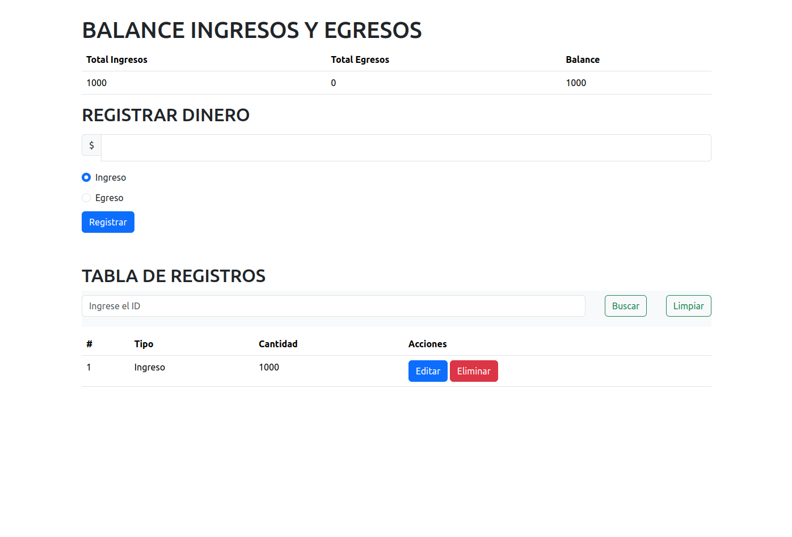
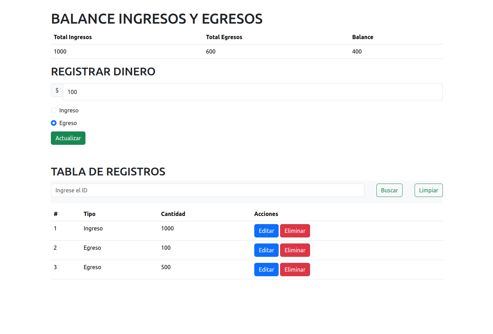
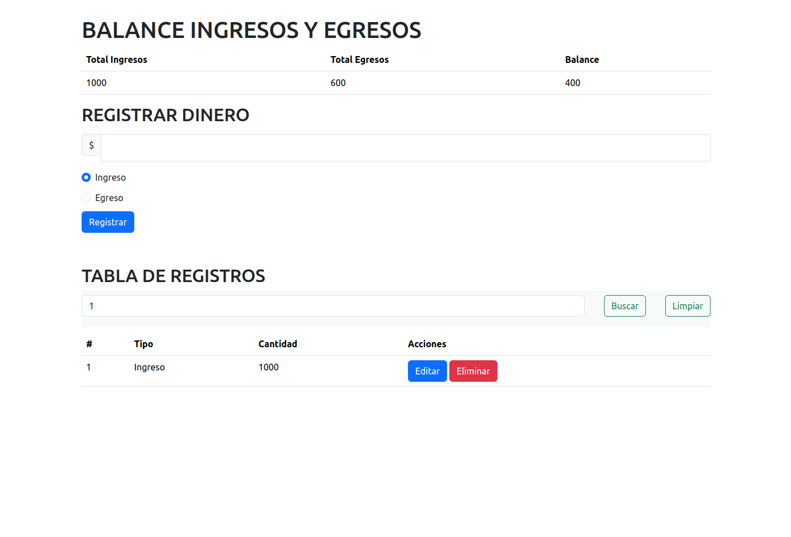

# Balance de Ingresos y Egresos

Este repositorio contiene un proyecto web que te permite llevar un registro de tus ingresos y egresos financieros, calcular tu balance y realizar búsquedas de transacciones específicas por ID. 

## Características principales

- **Registro de transacciones:** Puedes ingresar tus transacciones financieras, especificando el tipo (Ingreso o Egreso) y la cantidad.

- **Cálculo de balance:** El sistema calcula automáticamente el total de ingresos, el total de egresos y muestra el balance actual.

- **Búsqueda de transacciones:** Puedes buscar transacciones específicas por su ID.

- **Edición y eliminación:** Puedes editar y eliminar transacciones existentes.

## Tecnologías utilizadas

- HTML
- CSS
- JavaScript
- Bootstrap (para estilos y componentes)
- Node

## Cómo usar

NOTA: Para poder ejecutar el proyecto, debemos instalar algunas cosas primero en caso de no tenerlas:
1. Descargar la version 18.18.0 (https://nodejs.org/en).
2. Ejecutar el archivo descargado.

Luego de tener instalado lo anterior:

1. Clona este repositorio en tu máquina local con el siguiente comando: `git clone https://github.com/JershonEspitia/ProyectoPresupuestoCasa.git`.

2. Abre la terminal y ejecuta el comando `npm i`.

3. Ejecuta en la terminal `npm run dev` para arrancar el servidor.

4. Abre el archivo `index.html` en tu navegador web para ejecutar la aplicación.

5. Utiliza el formulario para registrar nuevas transacciones.

6. Puedes editar o eliminar transacciones existentes utilizando los botones correspondientes.

7. Utiliza la función de búsqueda para encontrar transacciones por su ID.

## Base de datos
Dirección de la base de datos: http://127.0.0.1:5010/Data

## Capturas

## Contribuciones

¡Las contribuciones son bienvenidas! Si tienes ideas de mejoras o correcciones, no dudes en crear una solicitud de extracción (pull request) o informar sobre problemas (issues).

## Autor

[By @JershonEspitia](https://github.com/JershonEspitia)